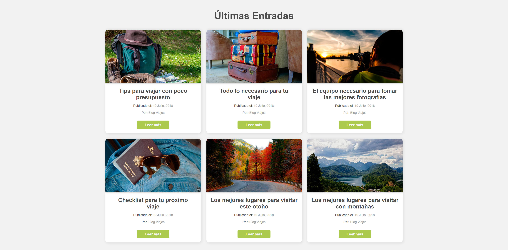

# Cards with flexbox

I created a cards landing for a simulated traveling company, using html and css.

## 🚀 Getting Started

You only need to open the .html file and you're set.

## 🎨 Preview

You can see the result here → [Cards with flexbox](https://themattfire.github.io/cards-flexbox/).

 
  
 💻 Desktop version 

  

  
 📱 Mobile version 

  

## 👩🏻‍💻 Technologies

1. HTML
2. CSS

Let me know what you think about it 😀
